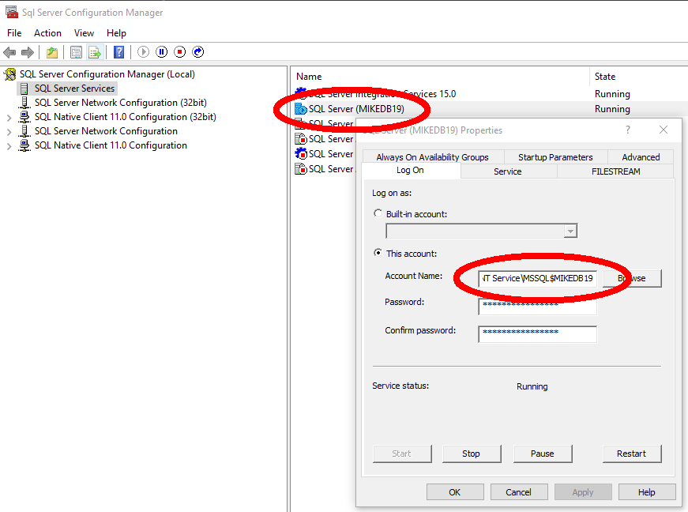
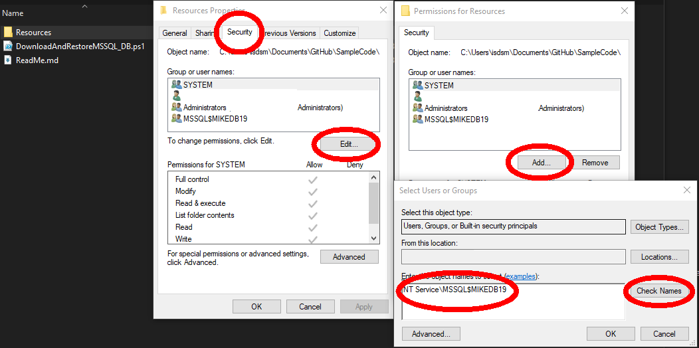
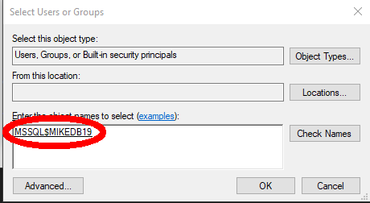

Created By: Mike Lee 
Created On: 2024-05-09 
Description: 
&nbsp;&nbsp;&nbsp;&nbsp;This PowerShell script downloads a list of .bak files from a source (Microsoft) and will restore it to  
&nbsp;&nbsp;&nbsp;&nbsp;the host machine's SQL Server instance. File will only download if it does not exist in Resources 
&nbsp;&nbsp;&nbsp;&nbsp;directory or if it was not downloaded today.
  
Instructions: 
&nbsp;&nbsp;&nbsp;&nbsp;1. Open DownloadAndRestoreMSSQL_DB.ps1 in a text editor and update the following variables: 
&nbsp;&nbsp;&nbsp;&nbsp;&nbsp;&nbsp;&nbsp;&nbsp;1a. <b>$SQL_ServerInstance</b>: Name of your Server 
&nbsp;&nbsp;&nbsp;&nbsp;&nbsp;&nbsp;&nbsp;&nbsp;1b. <b>$DB_DataPath</b>: Location for .mdf file 
&nbsp;&nbsp;&nbsp;&nbsp;&nbsp;&nbsp;&nbsp;&nbsp;1c. <b>$DB_DataPath</b>: Location for .ldf file 
&nbsp;&nbsp;&nbsp;&nbsp;&nbsp;&nbsp;&nbsp;&nbsp;1d. <b>$dbBackups</b>: .bak files you want to download 
&nbsp;&nbsp;&nbsp;&nbsp;2. Verify Account name for SQL Server has access to Resource Directory 
&nbsp;&nbsp;&nbsp;&nbsp;&nbsp;&nbsp;&nbsp;&nbsp;2a. Open Sql Server Configuration Manager 
&nbsp;&nbsp;&nbsp;&nbsp;&nbsp;&nbsp;&nbsp;&nbsp;2a. Right click your SQL Server instance and select Properties 
&nbsp;&nbsp;&nbsp;&nbsp;&nbsp;&nbsp;&nbsp;&nbsp;2b. Under Log On, copy the Account Name 
&nbsp;&nbsp;&nbsp;&nbsp;&nbsp;&nbsp;&nbsp;&nbsp; 
&nbsp;&nbsp;&nbsp;&nbsp;&nbsp;&nbsp;&nbsp;&nbsp;2c. In project direcotry, right click the Resources directory and click Properties 
&nbsp;&nbsp;&nbsp;&nbsp;&nbsp;&nbsp;&nbsp;&nbsp;2d. Under Security, click Edit 
&nbsp;&nbsp;&nbsp;&nbsp;&nbsp;&nbsp;&nbsp;&nbsp;2e. From Permissions for Resources, click Add 
&nbsp;&nbsp;&nbsp;&nbsp;&nbsp;&nbsp;&nbsp;&nbsp;2f. From Select Users or Groups, paste the SQL Server Account Name and click Check Names 
&nbsp;&nbsp;&nbsp;&nbsp;&nbsp;&nbsp;&nbsp;&nbsp; 
&nbsp;&nbsp;&nbsp;&nbsp;&nbsp;&nbsp;&nbsp;&nbsp;2g. If successful, name will update to user object.  
&nbsp;&nbsp;&nbsp;&nbsp;&nbsp;&nbsp;&nbsp;&nbsp; 